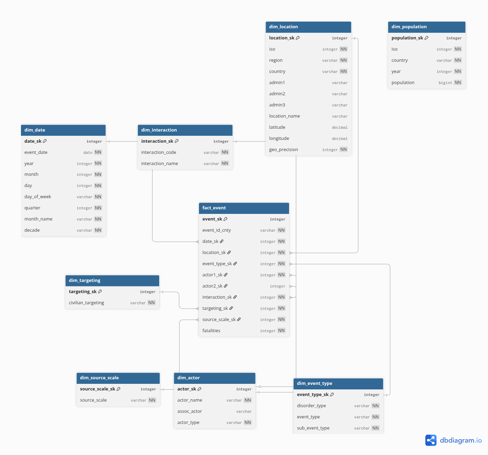
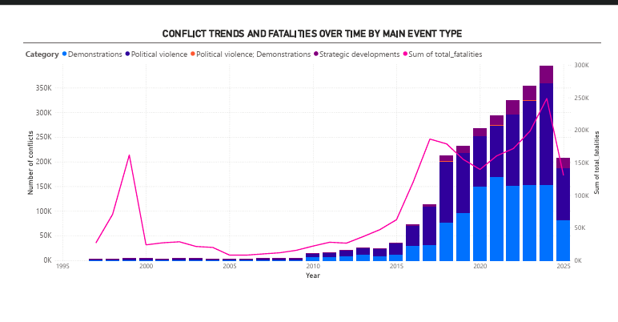
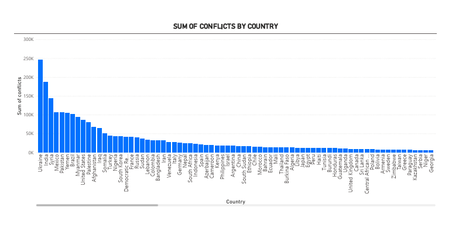
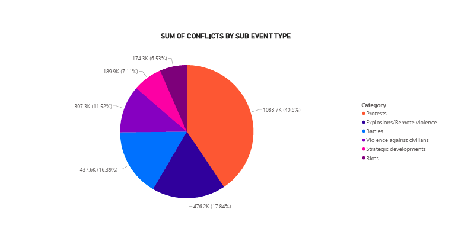

## Layered Architecture (Bronze → Silver → Gold)

**Core rule:** closer to source = more data stored. Closer to report = more filtered.

### Bronze
- Append-only, raw data as-is from API
- Never modify, never delete files
- Serves as immutable archive / reprocessing safety net

### Silver
- Single source of truth (one record per entity, latest version)
- Typing (string → int, string → date)
- Deduplication (latest timestamp wins)
- Removal of deleted/invalid records
- Format: Parquet (columnar, compressed)

### Gold
- Star schema (fact + dimension tables)
- Aggregations, joins, calculated metrics
- Reporting datasets optimized for BI tools
- Only columns needed for business questions

## Star Schema Model
Fact table `fact_events` (2,669,096 rows, grain = one event) + 6 conformed
dimensions, built in Athena (`sql/10_star_schema.sql`), FK integrity verified
(0 orphan keys). Power BI semantic model sits on top: relationships + DAX
measures (`docs/powerbi_semantic_layer.md`).

Original draft model:

## Sample charts

## Business Questions

### Geography and Scale
1. Which countries and regions have the most events, and which event types are most common there?
2. Where are the most deaths on the map, and which places have the highest number of fatalities per event?

### Time Trends
3. How did the number of events change over time (by year and month) for each `disorder_type`?
4. Are there seasonal patterns? Which months have the most events and fatalities?

### Event Types
5. Which `event_type` and `sub_event_type` cause the most deaths, and what is the average number of fatalities per event?
6. What is the ratio of peaceful protests to violent demonstrations, and how does it change over time?

### Actors
7. Which actors (`actor1`) cause the most events and deaths, and how did their activity change over time?
8. Which types of interaction (e.g., State forces vs Rebels) happen most often and are the bloodiest?

### Civilian Targeting
9. What percentage of events includes `civilian_targeting`, and how does this change by region and actor type?

### Sources and Precision
10. Where do the sources come from (`source_scale`: local vs international) in each region, and do more sources mean more reported events?

### Escalation
11. Which countries had the biggest increase in events year-over-year (YoY), and does more events always mean more fatalities?

### Per Capita Analysis
12. Which countries have the most events and fatalities per capita (per 100k people), and how does this change the ranking compared to total numbers?

