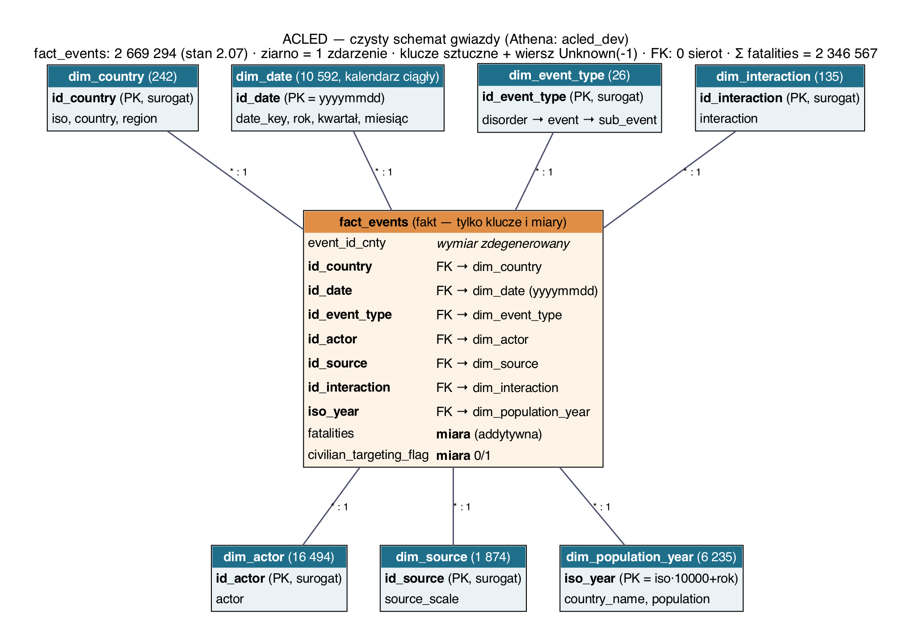
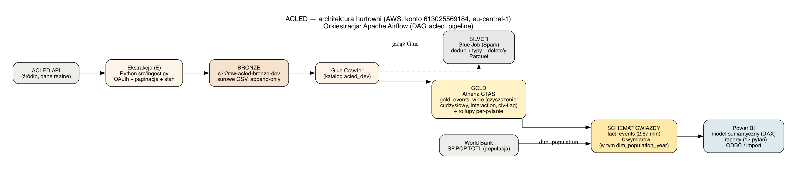

# Projekt ACLED — hurtownia danych: status, instrukcje i kontrola wymagań

Materiał zakłada pracę na gotowej hurtowni w AWS (S3 + Athena + Glue),
z orkiestracją Apache Airflow oraz warstwą semantyczną i raportową w Power BI
Desktop. Dokument prowadzi przez wszystkie wymagania projektu — w każdym bloku
sprawdzamy, co jest zrobione, gdzie to leży i jak to pokazać na żywo.

## Wymagania formalne (8 punktów z listy)

| # | Wymaganie | Status | Dowód |
|---|-----------|--------|-------|
| 1 | Zespół 2–4 osoby | ✅ | Oskar, Maciek, Karol |
| 2 | Dane z sieci, NIE generowane | ✅ | ACLED (realne dane o konfliktach, 1997–2025, 2,67 mln zdarzeń) + World Bank (populacja) |
| 3 | Pytania biznesowe | ✅ | 12 pytań — `README.md`, sekcja *Business Questions* |
| 4 | Model wielowymiarowy | ✅ | schemat gwiazdy — `main/sql/10_star_schema.sql`, diagram niżej |
| 5 | Baza hurtowni | ✅ | lakehouse: S3 (bronze/silver/gold) + AWS Athena + Glue Catalog |
| 6 | Narzędzie integracyjne + ETL | ✅ | **Apache Airflow** (`airflow/`) + AWS Glue + Athena CTAS |
| 7 | Warstwa semantyczna | ✅ (kod) / 🔄 (otwarcie) | model Power BI — wygenerowany w `powerbi/ACLED/`, 15 miar DAX, 6 relacji |
| 8 | Narzędzie raportowe + raporty | 🔄 | Power BI Desktop — 7 stron w scaffoldzie, styl do dokończenia |

---

## Blok 1. Pytania biznesowe — 5 pkt

**Gdzie jesteśmy:** `README.md`, sekcja *Business Questions*.

12 pytań w 8 kategoriach: geografia i skala, trendy czasowe, typy zdarzeń,
aktorzy, celowanie w cywili, źródła, eskalacja YoY, per capita. Do każdego
pytania istnieje zweryfikowane zapytanie SQL:

| Pytania | Plik SQL |
|---------|----------|
| Q1–Q5 | `main/sql/05_bi_queries.sql` |
| Q6–Q11 | `main/sql/08_bi_queries_extended.sql` |
| Q12 (per capita) | `main/sql/09_bi_queries_percapita.sql` |

**Wyjaśnienie.** Punkt jest przyznawany „pod warunkiem realizacji" — czyli
raporty (Blok 5) muszą faktycznie odpowiadać na te pytania. SQL-e per-pytanie
pełnią rolę uzasadnienia doboru wymiarów i miar; w Power BI na pytania
odpowiada JEDEN model gwiazdy + miary DAX.

**Zadanie kontrolne:** otwórz README i sprawdź, czy każdemu pytaniu umiesz
przypisać stronę raportu oraz miarę, która na nie odpowiada.

---

## Blok 2. Schemat gwiazdy — 5 pkt

**Gdzie jesteśmy:** `main/sql/10_star_schema.sql` + baza `acled_dev` w Athena.

Tabela faktów `fact_events` (2 669 096 wierszy, ziarno = jedno zdarzenie)
i 6 wymiarów: `dim_country`, `dim_date` (ciągły kalendarz 1997–2025),
`dim_event_type`, `dim_actor`, `dim_source`, `dim_population_year`.

**Kontrola poprawności (wykonana na żywo w Athena):**
- suma zdarzeń zgodna we wszystkich warstwach: **2 669 096**,
- integralność kluczy: **0 sierot** (każdy klucz z faktu istnieje w wymiarze),
- klucze wymiarów unikalne — również bez rozróżniania wielkości liter
  (Power BI traktuje klucze tekstowe case-insensitive),
- kalendarz ciągły: 10 592 dni, bez dziur (wymóg „Oznacz jako tabelę dat").

**Wyjaśnienie.** To czysta gwiazda (nie płatek śniegu): wymiary są
zdenormalizowane, fakt trzyma wyłącznie klucze i miary. `interaction`
pozostaje w fakcie jako wymiar zdegenerowany. Klucz `iso_year = iso·10000+rok`
spłaszcza złożony klucz (kraj, rok) do jednej kolumny, bo relacje Power BI są
jednokolumnowe.

**⚠️ Zadanie kontrolne (ORGANIZACYJNE, PILNE):** wyślij prowadzącej diagram
schematu do sprawdzenia (ogłoszenie: niesprawdzony schemat = ryzyko odrzucenia
projektu). Konsultacje: piątki 20:00, MS Teams, kod kursu `pzyozi0`.

---

## Blok 3. ETL uruchomiony na żywo — 20 pkt

**Gdzie jesteśmy:** katalog `airflow/` + `main/glue/silver_transform.py` + `main/src/`.

Przepływ: ACLED API → **E**kstrakcja (Python, `main/src/ingest.py`) → S3 bronze
(append-only) → Glue Crawler (katalog) → **T**ransformacje: Glue job (silver,
Spark) oraz Athena CTAS (gold: dedup, czyszczenie cudzysłowów, naprawa
`interaction`, flaga civilian targeting) → **Ł**adowanie do schematu gwiazdy.
Całość spina DAG Airflow `acled_pipeline`.

### Demo na żywo (przećwiczone — run z 1.07 zakończony sukcesem w ~75 s)

    cd airflow
    docker compose up -d
    docker compose exec airflow cat /opt/airflow/simple_auth_manager_passwords.json.generated

1. Wejdź na `http://localhost:8080`, zaloguj się (`admin` + hasło z pliku).
2. DAG `acled_pipeline` → przycisk **Trigger**.
3. Pokaż zielony graf: `gold_events_wide` → 6 tabel gwiazdy + `dim_date`.
4. Po zakończeniu pokaż w Athena, że tabele mają komplet danych (2 669 096).

**Wyjaśnienie.** Kroki Athena są **idempotentne** (DROP + czyszczenie prefixu
S3 + CTAS), więc DAG można odpalać wielokrotnie — także w trakcie obrony.
Gałąź Glue (crawler + silver job) jest opcjonalna (`run_glue=True`) i wymaga
rozszerzenia uprawnień IAM — gotowa polityka w `airflow/README.md`.
Pełna ekstrakcja z API wymaga pliku `.env` z kontem ACLED
(`ACLED_EMAIL`, `ACLED_PASSWORD`) — ma je właściciel konta ACLED.

**Zadanie kontrolne:** odpal `docker compose up -d`, wyzwól DAG i sprawdź,
czy wszystkie zadania są zielone, a `ingest`/`crawl_bronze`/`silver_transform`
mają status *skipped* (to poprawne przy domyślnych parametrach).

---

## Blok 4. Warstwa semantyczna — 10 pkt

**Gdzie jesteśmy:** `powerbi/ACLED/ACLED.pbip` (wygenerowany projekt) oraz
instrukcja ręczna `docs/powerbi_semantic_layer.md`.

Model — w całości zapisany w kodzie (TMDL), zgodny z metodą z zajęć:

| Element | Zawartość |
|---------|-----------|
| Tabele | 7 (fact_events + 6 wymiarów), import przez ODBC DSN `ACLED_Athena` |
| Relacje | 6 × wiele-do-jednego (\*:1), filtr pojedynczy, wymiar po stronie 1 |
| Miary DAX | 15, m.in. `Total Events`, `Fatalities per Event`, `Pct Civilian Targeting` (CALCULATE), `Peaceful to Violent Ratio`, `YoY Events %` (DATEADD), `Events per 100k`, `Distinct Actors` (DISTINCTCOUNT) — folder „Miary", formaty ustawione |
| Hierarchie | Kalendarz (Rok→Kwartał→Miesiąc), Geografia (Region→Kraj), Typ zdarzenia (Disorder→Event→Sub-event) |
| Porządek | chronologiczne sortowanie miesięcy (`month_name` po `month`), ukryte klucze techniczne, `dim_date` oznaczona jako tabela dat |

### Ścieżka A — otwarcie gotowego projektu (spróbuj najpierw, 5 min)

1. Pobierz świeże ZIP brancha i **Wyodrębnij wszystko** (nie kopiuj
   pojedynczych plików!).
2. Sprawdź, że w `powerbi\ACLED\ACLED.Report\` jest plik `definition.pbir`
   **i folder** `definition` — brak folderu to dokładnie błąd
   „Required artifact is missing".
3. Włącz 3 funkcje Preview (.pbip / PBIR / TMDL) → restart Power BI.
4. Otwórz `ACLED.pbip` w miejscu → **Odśwież** (użyje DSN `ACLED_Athena`).

### Ścieżka B — ręcznie (plan awaryjny, ~40–60 min)

Krok po kroku według `docs/powerbi_semantic_layer.md` — wszystkie miary DAX
do skopiowania, kolejność: import 7 tabel → 6 relacji → tabela dat →
hierarchie + sort miesięcy → miary → foldery/ukrycia.

**Zadanie kontrolne:** w Widoku modelu widać układ gwiazdy? Każda relacja ma
`1` po stronie wymiaru i `*` po stronie `fact_events`? Miesiące na wykresie
sortują się chronologicznie, a nie alfabetycznie?

---

## Blok 5. Raporty z wykresami — 10 pkt (DO DOKOŃCZENIA)

**Gdzie jesteśmy:** Power BI Desktop, na modelu z Bloku 4.
Mapa stron: `docs/powerbi_semantic_layer.md` (sekcja 4) + spec stylu
`docs/powerbi_design_spec.md`.

Układ: **Dashboard jako pierwsza strona** (4 karty KPI: Total Events, Total
Fatalities, Pct Civilian Targeting, Distinct Actors + trend + struktura),
potem 7 stron = 12 pytań biznesowych.

Checklist elementów wymaganych na zajęciach:

- [ ] karty KPI na dashboardzie, jeden rząd u góry
- [ ] slicery (Rok, Region, Disorder type) — **zsynchronizowane** między
  stronami (Widok → Synchronizuj fragmentatory)
- [ ] drill-down na hierarchii Kalendarz (Rok→Kwartał→Miesiąc)
- [ ] macierz sezonowości z **formatowaniem warunkowym** (mapa ciepła)
- [ ] posortowane chronologicznie miesiące (model już to wymusza)
- [ ] interakcje między wizualizacjami (Format → Edytuj interakcje)
- [ ] przyciski nawigacyjne Dashboard → strony szczegółowe
- [ ] tytuły stron i wszystkich wizualizacji, duże czytelne legendy
- [ ] formaty miar: liczby całkowite / procenty / 2 miejsca dziesiętne
- [ ] zapisany plik PBIX

Przykładowe wcześniejsze wizualizacje (do zachowania stylu):

**Zadanie kontrolne:** czy każda strona odpowiada na konkretne pytanie
z README i czy użytkownik nieznający modelu zrozumie ją w kilka sekund?

---

## Szybka pomoc: najczęstsze problemy

| Problem | Najczęstsza przyczyna | Co zrobić |
|---------|----------------------|-----------|
| „Required artifact is missing" przy otwieraniu PBIP | niepełne skopiowanie folderów (brak `.Report\definition\`) | rozpakuj CAŁE zip przez „Wyodrębnij wszystko", otwieraj w miejscu |
| „Właściwość Driver nie odpowiada…" | brak sterownika Athena ODBC | zainstaluj `AmazonAthenaODBC-2.2.0.0-windows-amd64.msi`, restart Power BI |
| „Missing authentication token" | zły typ uwierzytelnienia w DSN | Authentication Type = **IAM Credentials**, klucz jako Username, secret jako Password |
| Wizualizacja pokazuje wszędzie tę samą wartość | brak relacji / relacja nieaktywna | Widok modelu → sprawdź 6 relacji do `fact_events` |
| Miesiące sortują się alfabetycznie | brak sortowania po numerze | zaznacz `month_name` → Sortuj według kolumny → `month` |
| Relacja nie chce się utworzyć | duplikaty po stronie wymiaru / różne typy | klucze wymiarów są zweryfikowane jako unikalne — sprawdź, czy nie importujesz tabeli dwa razy |
| Miara zwraca puste wartości | filtr CALCULATE nie pasuje do danych | sprawdź dokładną wartość w kolumnie (np. `Peaceful protest` — wielkość liter) |
| DAG w Airflow czerwony na tabelach gwiazdy | wygasłe/niepełne uprawnienia AWS | odśwież kredki (`~/.aws`), sprawdź politykę w `airflow/README.md` |

---

## Do zrobienia przed obroną (prezentacja: pierwszy dzień zjazdu, 4.07)

| Kiedy | Co | Kto |
|-------|----|----|
| dziś | mail do prowadzącej: prośba o sprawdzenie schematu (załącz `main/images/star_schema.png`) | Oskar |
| dziś/jutro | otwarcie PBIP (Ścieżka A) lub model ręcznie (Ścieżka B) | Karol |
| jutro | 7 stron raportu + dashboard + checklist z Bloku 5 | Karol + Maciek |
| jutro 20:00 | konsultacje Teams (kod `pzyozi0`) — pokazać schemat | zespół |
| opcjonalnie | polityka IAM dla gałęzi Glue w Airflow (`airflow/README.md`) | osoba z adminem AWS |
| opcjonalnie | `.env` z kontem ACLED do demo pełnej ekstrakcji | właściciel konta |
| przed obroną | każdy umie opowiedzieć: warstwy bronze/silver/gold, czemu gwiazda a nie płatek, jak działa dedup (SCD typ 1 + tabela deletes), OLTP vs OLAP | zespół |
